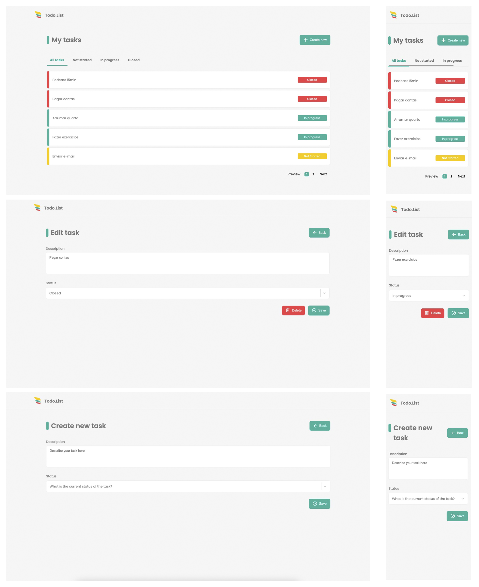

#  Todo.List

## ℹ️ Sobre o projeto

Este repositório contém um aplicativo Todo List criado com Next.js. O aplicativo usa Jest para testes e integra Prisma e MongoDB

## ✨ demonstração

</br>



</br>

## ✨ Deploy

Você pode conferir o resultado final em: [Vercel](https://harpio-todo-list.vercel.app/form)

## 🎯 Objetivo do projeto

O objetivo principal deste projeto é mostrar as habilidades de desenvolvimento do criador, aspirando a uma posição como Desenvolvedor Front-End em nível pleno. O projeto demonstra proficiência na construção de um aplicativo web moderno e escalonável usando tecnologias como Next.js, Prisma e MongoDB.

## 📝 Tecnologias

Para a realização desse projeto foi utilizado as seguintes tecnologias/linguagens:

- [NextJs](https://nextjs.org)
- [MongoDB](https://www.mongodb.com/pt-br)
- [Prisma](https://www.prisma.io)
- [React Hook Form](https://react-hook-form.com)
- [Zod](https://zod.dev)
- [Jest](https://jestjs.io)
- [Styled-components](https://styled-components.com)

#### Vantagens de usar Prisma, MongoDB, React Hook Form, Zod e componentes estilizados

##### Prisma

Prisma é um kit de ferramentas de banco de dados moderno que simplifica o acesso ao banco de dados no desenvolvimento web.

##### MongoDB

MongoDB é um banco de dados de documentos NoSQL que oferece diversas vantagens:

##### React Hook Form

React Hook Form é uma biblioteca para gerenciar o estado do formulário e validação em aplicativos React.

##### Zod

Zod é uma primeira biblioteca de declaração e validação de schema

##### Styled Components

Styled Components é uma poderosa biblioteca CSS-in-JS desenvolvida para estilizar aplicações React. Escolhi esta ferramenta em detrimento do Tailwind CSS, baseando-me na minha experiência prévia com a mesma. Considerando o prazo de entrega de 3 dias, a familiaridade com Styled Components aumentará significativamente a minha produtividade, permitindo-me concentrar em outras tecnologias essenciais para o projeto.

## ⚙️ Instalação

Para que este rode em sua máquina, siga os passos abaixo:

```bash
# Clone o repositório em alguma pasta em sua máquina
$ git clone https://github.com/Diegooliveyra/Harpio-Todo-List.git


# Entre no repositório
$ cd harpio-todo-list

Instale as dependencias digitando no termimal:
$ npm install || yarn

Rode a aplicação no modo de desenvolvimento.
$ npm run dev || yarn dev

Abra http://localhost:3000 no seu navegador para visualizar o projeto

Para os testes.
$ npm test || yarn test
```

## 📝 Licença

<p>O projeto se encontra sob licença MIT. Para mais detalhes, acesse <a href='LICENSE'>license<a>.</p>
<p>Criado com 💙 por <a href='https://github.com/Diegooliveyra/' target='blank'>Diego Oliveira</a></p>
